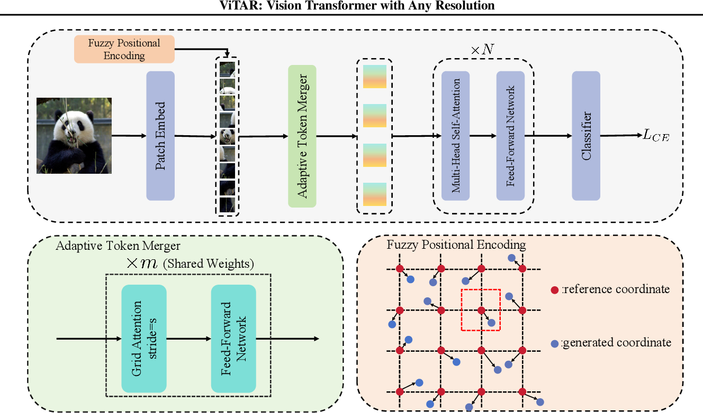
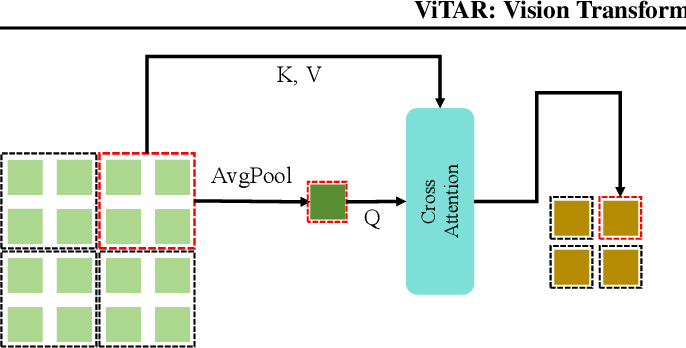
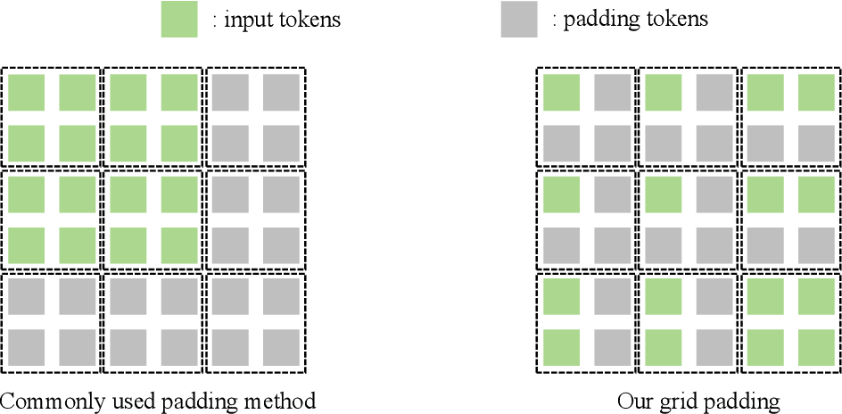

# ViTAR (Vision Transformer for Any Resolution)

This repository contains the PyTorch implementation of the paper "Vision Transformer for Any Resolution" (https://arxiv.org/abs/2403.18361) by Fan et al. ViTAR is a novel vision transformer architecture that can handle images of any resolution without requiring retraining or architectural changes.

## Features

- **Adaptive Resolution Handling**: Process images of any resolution without architectural modifications
- **Fuzzy Positional Encoding**: Novel positional encoding scheme that adapts to different image sizes
- **Adaptive Token Merger**: Efficient token reduction mechanism
- **Multi-Resolution Support**: Built-in support for handling batches of images with different resolutions
- **PyTorch Implementation**: Clean and efficient implementation using PyTorch

## Key Components

### Model Architecture


*Overview of the ViTAR architecture showing the main components and their interactions.*
*Implementation: `vitar.py`*

### Adaptive Token Merger


*Visualization of the Adaptive Token Merger (ATM) mechanism that efficiently reduces tokens while preserving important information.*
*Implementation: `model/AdaptiveTokenMerger.py`*

### Grid Padding Mechanism


*Adaptive grid padding for Adaptive Token Merger.*
*Implementation: `model/AdaptiveTokenMerger.py` (grid_pad function)*

### Fuzzy Positional Encoding
*Implementation: `model/FuzzyPositionalEncoding.py`*

## Installation

1. Clone the repository:
```bash
git clone https://github.com/vsa1920/ViTAR-Vision-Transformer-with-Any-Resolution.git
cd ViTAR
```

2. Install the required dependencies:
```bash
pip install -r requirements.txt
```

## Usage

### Basic Usage

```python
from vitar import ViTAR

# Initialize the model
model = ViTAR(
    embedding_dim=768,
    hidden_dim=4 * 768,
    Gh=14,  # Grid height
    Gt=14,  # Grid width
    pe_H=64,  # Positional encoding height
    pe_W=64,  # Positional encoding width
    num_heads=12,
    num_layers=12,
    num_classes=10  # Number of classes for classification
)

# The model can handle images of any resolution
# Example with different image sizes
image1 = torch.randn(1, 3, 224, 224)  # 224x224 image
image2 = torch.randn(1, 3, 384, 384)  # 384x384 image

# Process images
output1 = model(image1)
output2 = model(image2)
```

### Training

The repository includes a training script (`training.py`) that demonstrates how to train the model on the Imagenette dataset:

```bash
python training.py
```

### Visualization

To visualize the training process and results:

```bash
python visualize_training.py
```

## Project Structure

- `vitar.py`: Main implementation of the ViTAR model
- `training.py`: Training script
- `visualize_training.py`: Visualization utilities
- `model/`: Additional model components
- `data/`: Dataset storage directory

## Citation

If you use this implementation in your research, please cite the original paper:

```bibtex
@article{vitar2024,
  title={Vision Transformer for Any Resolution},
  author={Fan, Qihang and You, Quanzeng and Han, Xiaotian and Liu, Yongfei and Tao, Yunzhe and Huang, Huaibo and He, Ran and Yang, Hongxia},
  journal={arXiv preprint arXiv:2403.18361},
  year={2024}
}
```

## License

MIT License

Copyright (c) 2024 Vaibhav Sahu

Permission is hereby granted, free of charge, to any person obtaining a copy
of this software and associated documentation files (the "Software"), to deal
in the Software without restriction, including without limitation the rights
to use, copy, modify, merge, publish, distribute, sublicense, and/or sell
copies of the Software, and to permit persons to whom the Software is
furnished to do so, subject to the following conditions:

The above copyright notice and this permission notice shall be included in all
copies or substantial portions of the Software.

THE SOFTWARE IS PROVIDED "AS IS", WITHOUT WARRANTY OF ANY KIND, EXPRESS OR
IMPLIED, INCLUDING BUT NOT LIMITED TO THE WARRANTIES OF MERCHANTABILITY,
FITNESS FOR A PARTICULAR PURPOSE AND NONINFRINGEMENT. IN NO EVENT SHALL THE
AUTHORS OR COPYRIGHT HOLDERS BE LIABLE FOR ANY CLAIM, DAMAGES OR OTHER
LIABILITY, WHETHER IN AN ACTION OF CONTRACT, TORT OR OTHERWISE, ARISING FROM,
OUT OF OR IN CONNECTION WITH THE SOFTWARE OR THE USE OR OTHER DEALINGS IN THE
SOFTWARE.

## Contributing

Contributions are welcome! Please feel free to submit a Pull Request.
